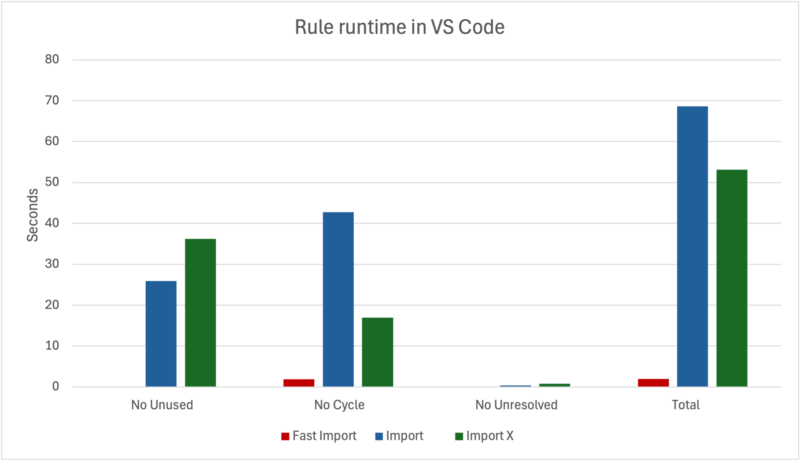

# eslint-plugin-fast-import

[](https://badge.fury.io/js/eslint-plugin-fast-import)  [](https://codecov.io/gh/nebrius/eslint-plugin-fast-import)

- [Installation](#installation)
- [Rules](#rules)
- [Configuration](#configuration)
  - [Configuration options](#configuration-options)
    - [rootDir (required)](#rootdir-required)
    - [alias](#alias)
    - [entryPoints](#entrypoints)
    - [ignorePatterns](#ignorepatterns)
    - [mode](#mode)
    - [editorUpdateRate](#editorupdaterate)
    - [debugLogging](#debuglogging)
- [Comparisons to import and import-x](#comparisons-to-import-and-import-x)
  - [Performance](#performance)
  - [Accuracy](#accuracy)
- [Algorithm](#algorithm)
  - [Phase 1: AST analysis](#phase-1-ast-analysis)
  - [Phase 2: Module specifier resolution](#phase-2-module-specifier-resolution)
  - [Phase 3: Import graph analysis](#phase-3-import-graph-analysis)
- [Limitations](#limitations)
  - [All first party code must live inside `rootDir`](#all-first-party-code-must-live-inside-rootdir)
  - [CommonJS is not supported](#commonjs-is-not-supported)
  - [Barrel exporting from third-party/built-in modules are ignored](#barrel-exporting-from-third-partybuilt-in-modules-are-ignored)
  - [Case insensitivity inconsistency in ESLint arguments](#case-insensitivity-inconsistency-in-eslint-arguments)
- [Creating new rules](#creating-new-rules)
  - [getESMInfo(context)](#getesminfocontext)
  - [getLocFromRange(context, range)](#getlocfromrangecontext-range)
  - [registerUpdateListener(listener)](#registerupdatelistenerlistener)
  - [isNonTestFile(filePath)](#isnontestfilefilepath)
- [Frequently Asked Questions](#frequently-asked-questions)
  - [Is this plugin a replacement for eslint-plugin-import/eslint-plugin-import-x?](#is-this-plugin-a-replacement-for-eslint-plugin-importeslint-plugin-import-x)
  - [Do you support user-supplied resolvers like eslint-plugin-import does?](#do-you-support-user-supplied-resolvers-like-eslint-plugin-import-does)
- [License](#license)


Fast Import implements a series of lint rules that validates imports and exports are used correctly. These rules specifically analyze who is importing what and looking for errors.

Fast Import uses a novel algorithm combined with the [OXC Rust based parser](https://www.npmjs.com/package/oxc-parser) that is significantly more performant than other import plugins. Fast Import also includes an editor mode that keeps its internal datastructures up to date with file system changes. This way you don't get stale errors in your editor when you change branches, unlike other plugins.

## Installation

```
npm install --save-dev eslint-plugin-fast-import
```

## Rules

💼 Configurations enabled in.<br />
🔧 Automatically fixable by the --fix CLI option.<br />
☑️ Set in the recommended configuration.<br />
🧰 Set in the all configuration.

| Name                                                                        | 💼   | 🔧   |
| --------------------------------------------------------------------------- | --- | --- |
| [no-unused-exports](src/rules/unused/README.md)                             | 🧰 ☑️ |     |
| [no-unresolved-imports](src/rules/unresolved/README.md)                     | 🧰 ☑️ |     |
| [no-cycle](src/rules/cycle/README.md)                                       | 🧰 ☑️ |     |
| [no-test-imports-in-prod](src/rules/testInProd/README.md)                   | 🧰 ☑️ |     |
| [no-entry-point-imports](src/rules/entryPoint/README.md)                    | 🧰 ☑️ |     |
| [no-external-barrel-reexports](src/rules/externalBarrelReexports/README.md) | 🧰 ☑️ |     |
| [no-named-as-default](src/rules/namedAsDefault/README.md)                   | 🧰 ☑️ |     |
| [require-node-prefix](src/rules/nodePrefix/README.md)                       | 🧰   | 🔧   |

There is also a configuration called "off" that disables all rules. This configuration is useful if you want to disable all rules for specific files after enabling rules for all other files.

## Configuration

Fast Import only supports ESLint 9+ and flat configs. For most simple TypeScript applications, you can add Fast Import with:

```js
import { recommended } from 'eslint-plugin-fast-import';
import { dirname } from 'node:path';
import { fileURLToPath } from 'node:url';

export default [
  recommended({
    rootDir: dirname(fileURLToPath(import.meta.url))
  })
];
```

This will apply the recommended rules along with the default configuration.

### Configuration options

Fast Import supports a number of configuration options. Fast Import attempts to auto-detect as many as possible, but you may need to tweak or suppliment these options.

#### rootDir (required)

Type: `string`

Fast Import uses `rootDir` to scan for files. When Fast Import starts up for the first time, it creates a map of all files in a project. Fast Import finds all files inside of `rootDir`, filters out any ignored files (see [ignorePatterns](#ignorepatterns) for more info), and analyzing remaining files.

Note: Fast Import automatically filters out folders named `node_modules`, `.git`, `build`, and `dist` regardless of ignore settings. These folders are almost always ignored anyways, and hard-coding this list improves performance. If you want to analyze one of these folders, file an issue and we'll find a way to support your use case.

`rootDir` _must_ be an absolute path!

CommonJS Example:

```js
recommended({
  rootDir: __dirname
})
```

ESM Example using `dirname` from `node:path` and `fileURLToPath` from `node:url`:

```js
recommended({
  rootDir: dirname(fileURLToPath(import.meta.url))
})
```

#### alias

Type: `Record<string, string>`

`alias` defines a set of module specifier aliases. For example, if you use Next.js with its default configuration, you're probably familiar with the alias it creates: `@/` points to `src/`, such that a file inside of `src` can import `src/components/foo/index.ts` with `@/components/foo`.

Fast Import defaults to the values inside of `tsconfig.json`, if present, with a few limitations:
- Aliases that point to files outside of `rootDir`, or point to files inside of `node_modules`, are ignored
- Aliases with more than one file, e.g. `"@/": ["a.ts", "b.ts"]`, are ignored

Example:

```js
recommended({
  rootDir: __dirname
  alias: {
    '@/*': 'src/*'
    'foo': 'src/foo.ts'
  }
})
```

Note: patterns with a single star after them will match any symbols/files that start with the symbol/filepath.

#### entryPoints

Type: `Array<{ glob: string, symbols: string[]}>`

Entry points define exports that are not imported by code inside of the code base, but instead by code outside of the codebase.

For example, if you are building a Next.js application, then the `default` export in files titled `page.tsx`, `layout.tsx`, etc. are imported by the Next.js runtime itself, and thus Fast Import never sees the import.

Entry points allows you to define these types of imports so they are not flagged as unused, and enable other useful checks such as the [no-entry-point-imports](./src/rules/entryPoint/README.md) rule.

Example:

```js
recommended({
  rootDir: __dirname
  entryPoints: [
    {
      file: './src/index.ts',
      symbols: ['default', 'anotherExport']
    },
    {
      file: './src/app/**/page.tsx',
      symbols: ['default']
    }
  ]
})
```

#### ignorePatterns

Type : `string[]`

A list of ignore patterns, using the format used by `.gitignore` files. Files that match these patterns are excluded from analysis.

By default, Fast Import includes the contents of all `.gitignore` files that apply to each file, taking into account nesting, between the file in question and the closest parent folder that contains a `.git` folder. In other words, if you have a fully fleshed out `.gitignore` setup, you can likely ignore this setting.

Example:

```js
recommended({
  rootDir: __dirname
  ignorePatterns: [
    'src/**/__test__/**/snapshot/**/*',
    '*.pid'
  ]
})
```

#### mode

Type: `'auto' | 'one-shot' | 'fix' | 'editor'`

When set to `auto`, the default, Fast Import will do it's best to determine which environment it's running in.

`one-shot` mode assumes that each file will be linted exactly once. This mode optimizes for running ESLint from the command line without a fix flag. In this mode, Fast Import first creates a map of all files, but does not enable any caching because it is assumed files will not be updated throughout the duration of the run. This mode should be used in CI.

`fix` builds on `one-shot` by introducing the caching layer, and is the default when ESLint is supplied with a fix flag. Each time a rule is called, Fast Import updates its cache if any imports/exports are modified in a file. This mode is used by default when the `--fix`, `--fix-dry-run`, or `--fix-type` is sent to ESLint.

Finally, `editor` mode builds on `fix` mode by adding a file watcher that looks for changes at a regular interval defined by [`editorUpdateRate`](#editorupdaterate). When changes are detected, the file map is updated. This allows Fast Import to respond to changes outside of the editor, such as when running `git checkout`, `git stash`, etc.

Note: currently, VS Code and Cursor are the only supported editors. If you would like support for another editor, open an issue and I'll work with you to get the information needed to support your editor. In the mean time, you can create a config that extends your standard config, set the mode to editor, and tell your editor to use this config file

#### editorUpdateRate

Type: `number`

Defines the rate in milliseconds at which Fast Import looks for file changes, and defaults to once every 5 seconds.

Example:

```js
recommended({
  rootDir: __dirname
  editorUpdateRate: 2_000
})
```

#### debugLogging

Type: boolean

When set to `true`, enables extra logging that tells you performance numbers, when files are updated, and more.

Example:

```js
recommended({
  rootDir: __dirname
  debugLogging: true
})
```

## Comparisons to import and import-x

Below are performance and accuracy comparisons to [eslint-plugin-import](https://github.com/import-js/eslint-plugin-import) and [eslint-plugin-import-x](https://github.com/un-ts/eslint-plugin-import-x)

### Performance

To compare performance of this plugin vs the other plugins, I forked the VS Code codebase. VS Code is a large codebase with the following stats as of this writing:

- 5,299 files
- 1,255,760 lines of code, excluding blank lines and comments (according to [cloc](https://github.com/AlDanial/cloc))
- 88,623 imports
- 17,477 exports
- 184 reexports

Here are the results for three commonly expensive rules that flag unused exports, import cycles, and unresolved imports:



And here's the raw data:

|             | No Unused  | No Cycle   | No Unresolved | Total      |
| ----------- | ---------- | ---------- | ------------- | ---------- |
| Fast Import | 55.6ms     | 1,880.6ms  | 15.2ms        | 1,936.2ms  |
| Import      | 25,903.8ms | 42,710.7ms | 399.1ms       | 68,614.5ms |
| Import X    | 36,200.9ms | 16,931.7ms | 821.6ms       | 53,132.5ms |

If you would like to see details of how this data was computed, see the [script I wrote in my fork of VS Code](https://github.com/nebrius/vscode/blob/fast-import-perf/compare.ts).

Fun fact: Fast Import was originally written using [TypeScript ESLint's parser](https://www.npmjs.com/package/@typescript-eslint/parser) instead of OXC, which you can see [here](https://github.com/nebrius/eslint-plugin-fast-import/blob/4dde22b599db22dbb7421bf094edb48dddf6bb6b/src/module/computeBaseFileDetails.ts). That version of Fast Import took about 12 seconds to lint VS Code, which is still considerably faster than the others. The performance improvements between this plugin and others is split almost exactly 50/50 between the switch to OXC and the [algorithm described below](#algorithm).

### Accuracy

The performance script I wrote above also counts the number of errors found. Before I present the results, I want to emphasis that these are _not_ issues in VS Code! I intentionally configured ESLint to check test files, and VS Code includes test files with intentional errors so that they can make sure VS Code handles errors correctly. Now on to the errors:

|             | Unused | Cycle | Unresolved |
| ----------- | ------ | ----- | ---------- |
| Fast Import | 4,672  | 686   | 306        |
| Import      | 4,500  | 600   | 29         |
| Import X    | 4,521  | 600   | 49         |

We notice that the numbers are pretty close to each other, with Fast import reporting a few more. While I haven't looked at each error to determine precisely what's going on, I'm pretty certain it's due to:

- Fast Import flagging non-test exports as unused if they are only imported in test files, which the other two don't check
- Fast import flagging imports of third party modules that are not listed in package.json (aka transient imports) as unresolved

I do find it interesting that Fast Import finds a few more cycles. The 600 number is oddly round though, so perhaps their cycle detection algorithm has a limit on how many cycles it reports.

Details aside, we can safely say that all three libraries have about the same level of accuracy

## Algorithm

Fast import works by using a three phase pipelined algorithm that is very cache friendly. Each phase is isolated from the other phases so that they can each implement a caching layer that is tuned for that specific phase.

### Phase 1: AST analysis

This phase reads in every non-ignored inside `rootDir` with a known JavaScript extension (`.js`, `.mjs`, `.cjs`, `.jsx`, `.ts`, `.mts`, `.cts`, `.tsx`) and parses the file into an AST. The AST is then converted into an import/export specific form optimized for import/export analysis.

For example, the import statement `import { foo } from './bar'` gets boiled down to:

```js
{
  importAlias: 'foo',
  importName: 'foo'
  importType: 'single',
  isTypeImport: false,
  moduleSpecifier: './bar',
  statementNodeRange: [0, 27],
  reportNode: [9, 12]
}
```

This phase is by far the most performance intensive of the three phases due to file reads and AST parsing, comprising over 80% of total execution time on a cold cache. At the same time, information computed for each file is completely independent of information in any other file. This correlation is exploited at the caching layer, because changes to any one file do not result in cache invalidations of any other file.

For example, this phase takes 1.26 seconds on a cold cache running on the VS Code codebase on my laptop, out of 1.52 seconds total. Subsequent file edits in the editor only take ~1ms due to the high cacheability of this phase.

Details for the information computed in this stage can be viewed in the [types file for base information](./src/types/base.ts).

### Phase 2: Module specifier resolution

This phase goes through every import/reexport entry from the first phase and resolves the module specifier. This fast is the second most performance intensive phase, taking aroudn 15% of total execution time. On VS Code, this phase takes 0.21 seconds, out of 1.52 seconds total.

Fast Import uses its own high-performance resolver to achieve this speed. It resolves module specifiers to one of three types in a very specific order:

1. A Node.js built-in module, as reported by `builtinModules()` in the `node:module` module
2. A file within `rootDir`, aka first party
3. A third party module

Module specifiers are resolved in this order because we already have a list of built-in modules and first party files _in memory_. By following this flow, we never have to touch the file system to do any resolving! This makes Fast Imports resolution algorithm considerably faster than other resolvers. In specific, by moving third party module resolution to the end, we can "default" to imports being third party imports and never have to look at `node_modules`.

In this phase, changes to one file may impact the information in another file. Nonetheless, determining which files is impacted is relatively straightforward. In addition, changes typically do not impact a large number of other file's caches. This means we can still use caching in this phase to measureably improve performance.

Details for the information computed in this stage can be viewed in the [types file for resolved information](./src/types/resolved.ts).

### Phase 3: Import graph analysis

This final stage traverses the import/export graph created in the second phase to determine the ultimate source of all imports/reexports. In addition, we store other useful pieces of information, such as collecting a list of everyone who imports a specific export, and linking each import statement to a specific export statement.

This phase is the least performance intensive, representing only about 3% of total run time. On the VS Code Codebase, this phase takes 48ms, out of 1.52 seconds total.

Linking imports to exports can be non-trivial, especially if there are a lot of reexports. For example:

```js
// a.ts
import b from './b'; // points to file d.ts!

// b.ts
export { default } from './c';

// c.ts
export { default } from './d';

// d.ts
export default 10; // Export for import in file a.ts!
```

As we'v seen, this phase is not performance intensive due to all the heavy lifting we've done in the first two phases. It is also the most entangled and difficult to cache, as we saw in the example above. As a result, Fast Import does not do any caching during this phase, since it has little effect on overal performance anyways.

Details for the information computed in this stage can be viewed in the [types file for analyzed information](./src/types/analyzed.ts).

## Limitations

### All first party code must live inside `rootDir`

If files exist outside of `rootDir` and are imported by files inside of `rootDir`, then these imports will be marked as third party imports. However, since these files are not listed as a dependency in `package.json`, they will be flagged by the [no-unresolved-imports](src/rules/unresolved/README.md) rule.

### CommonJS is not supported

If your code base mixes CommonJS and ESM, then this plugin will report any imports of CommonJS exports as invalid imports. If you use mixed CommonJS/ESM or CommonJS only, then you should not use this plugin.

### Barrel exporting from third-party/built-in modules are ignored

Fast Import disables all checks on barrel imports from third party/builtin modules. For example, if you do this:

```js
// a.ts
export * from 'node:path';

// b.ts
import { fake } from './a';
```

Fast Import will not flag this as an error. This level of indirection is discouraged anyways, and is why Fast Import ships with the [no-external-barrel-reexports](src/rules/externalBarrelReexports/README.md) rule.

For more details, see the limitations section of the [src/rules/unresolved/README.md#limitations](src/rules/unresolved/README.md)

### Case insensitivity inconsistency in ESLint arguments

If you pass a file pattern or path to ESLint, ESLint inconsistenly applies case insensitivity. For example, let's say you have a file at `src/someFile.ts`, and you run ESLint with `eslint src/somefile.ts`. ESLint will parse the file, but it reports the filename internally as `src/somefile.ts`, not `src/someFile.ts`. However, Fast Import will only be aware of the file at `src/someFile.ts`.

## Creating new rules

Fast import is designed to be extended. For a complete example, check out the source code for the [no-unused-exports](src/rules/unused/unused.ts) lint rule for a relatively simple example, or the source code for the [no-cycle](src/rules/cycle/cycle.ts) rule for a more complex example. Fast Import exports a few helper functions used to write rules.

### getESMInfo(context)

This is the most important of the three functions. If the file represented by the ESLint context has been analyzed by Fast Import, an object with the following properties are returned, otherwise `undefined` is returned:

- `fileInfo`: the ESM info of the current file
- `projectInfo`: the ESM info of the entire project
- `settings`: the computed settings, with all defaults applied, used by Fast Import

See the TypeScript types for full details, which are reasonably well commented.

Each ESM entry includes two AST node ranges. A range is the start and end string indices of the node in the original source code. The first range is the range for the entire statement, and the second is a "report" range that is almost always what you want to pass to `context.reportError`. The report range is scoped to the most useful AST node representing the import, export, or reexprt. For example, in `import { foo } from './bar'`, the statement range represents all of the code, and the report range is scoped to just `foo`.

See [getLocFromRange](#getlocfromrange) for more information on using ranges to report errors

When creating a rule, you shouldn't traverse the AST yourself, since the AST has already been traversed for you. Each `context` callback should look something like this:

```js
create(context) {
  const esmInfo = getESMInfo(context);
  if (!esmInfo) {
    return {};
  }

  const { fileInfo } = esmInfo;
  // fileType indicates if this is a JS parseable file, or something else such as a JSON, PNG, etc
  if (fileInfo.fileType !== 'code') {
    return {};
  }

  // Do checks here

  // Always return an empty object
  return {};
}
```

Note that an empty object is returned, indicating we don't want to traverse the AST.

### getLocFromRange(context, range)

As we read in the previous section, Fast Import provides AST ranges for reporting errors. `context.report` however doesn't accept ranges directly, so we need to convert it first. `getLocFromRange` is a small wrapper around ESLint's built-in utilities for converting ranges to locations, which `context.report` _can_ accept. Reporting an error using this function looks like this:

```js
context.report({
  messageId: 'someMessageId',
  loc: getLocFromRange(context, someImportEntry.reportNodeRange)
})
```

### registerUpdateListener(listener)

Some rules may compute their own derived information that is also performance sensitive, such as the `no-cycle` rule. In these cases, you can rely on the `registerUpdateListener` callback to be notified any time the cache is updated.

### isNonTestFile(filePath)

A helper function to determine whether or not a given file path represents a test file. Currently, a file is considered a test file if either of the following are true:

- The file is directly or indirectly inside a folder called `__test__`
- The file includes `.test.` in it's name.

## Frequently Asked Questions

### Is this plugin a replacement for [eslint-plugin-import](https://github.com/import-js/eslint-plugin-import)/[eslint-plugin-import-x](https://github.com/un-ts/eslint-plugin-import-x)?

No, not for the most part. Fast Import replaces a few select rules from import and import x that are known to be slow, such as `no-cycle`, but otherwise strives to coexist with these packages. It is recommended that you continue to use these other rules for more comprehensive import analysis.

### Do you support user-supplied resolvers like eslint-plugin-import does?

No, Fast Import cannot use off the shelf resolvers, by design. Off the shelf resolvers work by reading the filesystem to see what files are available, which is inhernetly slow. By contrast, Fast Import uses its own resolution algorithm that reuses information that already exists in memory so that it never has to touch the filesystem. This resolution algorithm is one of the key reasons Fast Import is able to achieve the performance it does.

If Fast Import's resolution algorithm does not support your use case, please file an issue and I'll try to add support for it.

For more information, see the algorithm section [Phase 2: Module specifier resolution](#phase-2-module-specifier-resolution).

## License

Copyright (c) 2025 Bryan Hughes

Permission is hereby granted, free of charge, to any person obtaining a copy
of this software and associated documentation files (the "Software"), to deal
in the Software without restriction, including without limitation the rights
to use, copy, modify, merge, publish, distribute, sublicense, and/or sell
copies of the Software, and to permit persons to whom the Software is
furnished to do so, subject to the following conditions:

The above copyright notice and this permission notice shall be included in all
copies or substantial portions of the Software.

THE SOFTWARE IS PROVIDED "AS IS", WITHOUT WARRANTY OF ANY KIND, EXPRESS OR
IMPLIED, INCLUDING BUT NOT LIMITED TO THE WARRANTIES OF MERCHANTABILITY,
FITNESS FOR A PARTICULAR PURPOSE AND NONINFRINGEMENT. IN NO EVENT SHALL THE
AUTHORS OR COPYRIGHT HOLDERS BE LIABLE FOR ANY CLAIM, DAMAGES OR OTHER
LIABILITY, WHETHER IN AN ACTION OF CONTRACT, TORT OR OTHERWISE, ARISING FROM,
OUT OF OR IN CONNECTION WITH THE SOFTWARE OR THE USE OR OTHER DEALINGS IN THE
SOFTWARE.
