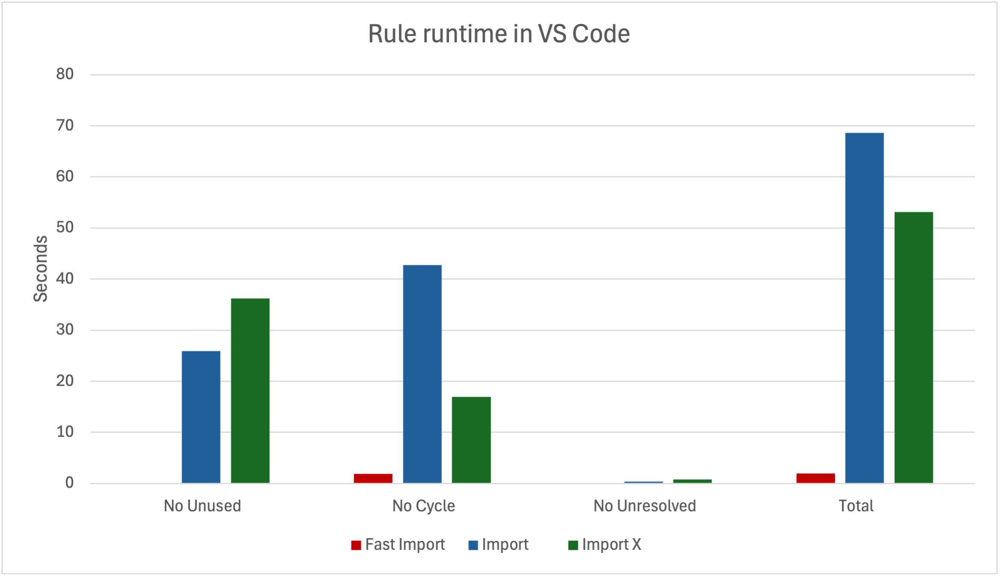

# Import Integrity

[](https://badge.fury.io/js/import-integrity-lint)  [](https://codecov.io/gh/nebrius/import-integrity-lint)

> [!WARNING]
> This README documents version 3 of Import Integrity. Version 3 is currently under active development on main and is a significant rewrite. To see documentation for the current production version, see the [version 2.2.1 docs](https://github.com/nebrius/import-integrity-lint/tree/2.2.1).

- [Installation](#installation)
- [Rules](#rules)
  - [Usage](#usage)
  - [Style](#style)
  - [Footguns](#footguns)
- [Configuration](#configuration)
  - [Configuration files](#configuration-files)
  - [Repo-level configuration options](#repo-level-configuration-options)
    - [packageRootDir](#packagerootdir)
    - [monorepoRootDir (monorepo)](#monoreporootdir-monorepo)
    - [mode](#mode)
    - [editorUpdateRate](#editorupdaterate)
    - [debugLogging](#debuglogging)
  - [Package-level configuration options](#package-level-configuration-options)
    - [alias](#alias)
    - [externallyImportedFiles / entryPointFiles](#externallyimportedfiles--entrypointfiles)
    - [ignorePatterns](#ignorepatterns)
    - [ignoreOverridePatterns](#ignoreoverridepatterns)
    - [testFilePatterns](#testfilepatterns)
  - [Use in monorepos](#use-in-monorepos)
    - [Option 1: one root config with `monorepoRootDir`](#option-1-one-root-config-with-monoreporootdir)
    - [Option 2: separate configs per package](#option-2-separate-configs-per-package)
    - [Option 3: root + separate configs (recommended)](#option-3-root--separate-configs-recommended)
  - [Using with Oxlint](#using-with-oxlint)
- [Comparisons to import and import-x](#comparisons-to-import-and-import-x)
  - [Performance](#performance)
  - [Accuracy](#accuracy)
- [Algorithm](#algorithm)
  - [Phase 1: AST analysis](#phase-1-ast-analysis)
  - [Phase 2: Module specifier resolution](#phase-2-module-specifier-resolution)
  - [Phase 3: Import graph analysis](#phase-3-import-graph-analysis)
  - [Phase 4: Monorepo analysis](#phase-4-monorepo-analysis)
- [Limitations](#limitations)
  - [All first party code must live inside `packageRootDir`](#all-first-party-code-must-live-inside-packagerootdir)
  - [CommonJS is not supported](#commonjs-is-not-supported)
  - [Barrel exporting from third-party/built-in modules are ignored](#barrel-exporting-from-third-partybuilt-in-modules-are-ignored)
  - [Non-named barrel export entry points are not considered in external dependency tracking](#non-named-barrel-export-entry-points-are-not-considered-in-external-dependency-tracking)
  - [Case insensitivity inconsistency in ESLint arguments](#case-insensitivity-inconsistency-in-eslint-arguments)
  - [Entrypoint file patterns with more than one wildcard are not supported](#entrypoint-file-patterns-with-more-than-one-wildcard-are-not-supported)
- [Creating new rules](#creating-new-rules)
  - [getESMInfo(context)](#getesminfocontext)
  - [getLocFromRange(context, range)](#getlocfromrangecontext-range)
  - [registerUpdateListener(listener)](#registerupdatelistenerlistener)
  - [isNonTestFile(filePath)](#isnontestfilefilepath)
- [Frequently Asked Questions](#frequently-asked-questions)
  - [Is this plugin a replacement for eslint-plugin-import/eslint-plugin-import-x?](#is-this-plugin-a-replacement-for-eslint-plugin-importeslint-plugin-import-x)
  - [Do you support user-supplied resolvers like eslint-plugin-import does?](#do-you-support-user-supplied-resolvers-like-eslint-plugin-import-does)
- [License](#license)

Import Integrity implements a series of lint rules that validates imports and exports are used correctly. These rules specifically analyze who is importing what and looking for errors.

Import Integrity uses a novel algorithm combined with the [Oxc Rust based parser](https://www.npmjs.com/package/oxc-parser) that is significantly more performant than other third-party ESLint import plugins. Import Integrity also includes an editor mode that keeps its internal datastructures up to date with file system changes. This way you don't get stale errors in your editor when you change branches, unlike other plugins.

## Getting Started

Install the plugin from npm:

```bash
npm install --save-dev import-integrity-lint
```

For typical single-package-per-repo projects, you can enable Import Integrity with:

```js
// ESLint
import { defineConfig } from 'eslint/config';
import importIntegrityPlugin from 'import-integrity-lint';

export default defineConfig([
  {
    settings: {
      'import-integrity': {
        packageRootDir: import.meta.dirname,
      },
    },
  },
  importIntegrityPlugin.configs.recommended,
]);
```

```js
// Oxlint
import importIntegrityPlugin from 'import-integrity-lint';

export default {
  settings: {
    'import-integrity': {
      packageRootDir: import.meta.dirname,
    },
  },
  jsPlugins: [{
    name: 'import-integrity',
    specifier: 'import-integrity-lint',
  }],
  rules: {
    ...importIntegrityPlugin.configs.recommended.rules,
  },
}

```

## Rules

🔧 Automatically fixable by the --fix CLI option.<br />
☑️ Set in the recommended configuration.<br />
🧰 Set in the monorepo configuration.

There is also a configuration called "off" that disables all rules. This configuration is useful if you want to disable all rules for specific files after enabling rules for all other files.

### Usage

These rules look for issues with how you're using imports/exports.

| Name                                                                             | 💼    | 🔧  |
| -------------------------------------------------------------------------------- | ----- | --- |
| [no-cycle](src/rules/no-cycle/README.md)                                         |    ☑️ |     |
| [no-test-only-imports](src/rules/no-test-only-imports/README.md)                 |    ☑️ |     |
| [no-test-imports-in-prod](src/rules/no-test-imports-in-prod/README.md)           |    ☑️ |     |
| [no-unused-exports](src/rules/no-unused-exports/README.md)                       |    ☑️ |     |
| [no-unused-package-exports](src/rules/no-unused-package-exports/README.md)       | 🧰    |     |
| [no-node-builtins](src/rules/no-node-builtins/README.md) \*                      |       |     |
| [no-restricted-imports](src/rules/no-restricted-imports/README.md) \*\*          |       |     |

\* No node builtins is intended for non-Node.js environments which can only be determined by the user, and so is not enabled in any default configuration.

\*\* No restricted imports requires rule-specific options for use, and so is not enabled in any default configuration.

### Style

These rules govern the style of imports/exports.

| Name                                                                             | 💼    | 🔧  |
| -------------------------------------------------------------------------------- | ----- | --- |
| [prefer-alias-imports](src/rules/prefer-alias-imports/README.md)                 |    ☑️ | 🔧  |
| [require-node-prefix](src/rules/require-node-prefix/README.md)                   |    ☑️ | 🔧  |


### Footguns

These rules are designed to prevent certain types of imports/export usage that are prone to easy-to_miss problems.

| Name                                                                             | 💼    | 🔧  |
| -------------------------------------------------------------------------------- | ----- | --- |
| [no-empty-entry-points](src/rules/no-empty-entry-points/README.md)               |    ☑️ |     |
| [no-entry-point-imports](src/rules/no-entry-point-imports/README.md)             |    ☑️ |     |
| [no-external-barrel-reexports](src/rules/no-external-barrel-reexports/README.md) |    ☑️ |     |
| [no-named-as-default](src/rules/no-named-as-default/README.md)                   |    ☑️ |     |
| [no-unnamed-entry-point-exports](src/rules/no-unnamed-entry-point-exports/README.md) |    ☑️ |     |
| [no-unresolved-imports](src/rules/no-unresolved-imports/README.md)               |    ☑️ |     |

## Configuration

Configuration options are split into two groups: repo-level configuration options and package-level configuration options. In the single package case, which we call "single package mode", there isn't a distinction between the two groups. When [using a lint config at the repo root](#option-1-one-root-config-with-monoreporootdir) to apply to more than one package, which we call "monorepo mode," repo-level options apply to all packages in the monorepo, while package-level options are specified per-package.

To support this "split-level" configuration, Import Integrity uses separate configuration files for package-level options that are independent of the ESLint/Oxlint configuration, while repo-level options go in `settings['import-integrity']` in the ESLint/Oxlint configuration file.

In single package mode, package-level options can also go in `settings['import-integrity']` if you prefer to not create a separate configuration file.

In monorepo mode, custom package-level options are required to be in a configuration file, not `settings['import-integrity']`. Import Integrity uses your monorepo's workspace configuration to determine which packages to analyze (supports Yarn, npm, Lerna, pnpm, Bun, and Rush). If a workspace package has a configuration file, Import Integrity loads its package-level options from that file. Workspace packages without a configuration file fall back to default values for all package-level options.

Configuration files are written using JSON-C (JSON with comments) and are named `import-integrity.config.json` or `import-integrity.config.jsonc`. These files must live in the package root dir as a sibling to `package.json` and `tsconfig.json`. In monorepo mode, you must set `name` in `package.json`, because this is used by Import Integrity for cross-package import analysis.

### Repo-level configuration options

#### packageRootDir

Type: `string`

Import Integrity uses `packageRootDir` to scan for files in the current package. When Import Integrity starts up for the first time, it creates a map of all files inside of `packageRootDir`, filters out any ignored files (see [ignorePatterns](#ignorepatterns) for more info), and analyzes the remaining files.

Note: Import Integrity does not analyze files in folders named `node_modules`, `build`, `out`, `dist`, and any folder or file that starts with a `.`, regardless of ignore settings. These folders are almost always ignored anyways, and hard-coding this list improves performance. If you want to analyze files in one of these folders, file an issue and we'll find a way to support your use case.

In single package mode, you must set `packageRootDir` directly in `settings['import-integrity']`.

In monorepo mode, every package still has a `packageRootDir` under the hood, but it is automatically set to the directory discovered from the workspace configuration.

`packageRootDir` must be an absolute path that points to the directory containing the package's `package.json` and `tsconfig.json`, not a nested `src` directory.

CommonJS Example:

```js
{
  settings: {
    'import-integrity': {
      packageRootDir: __dirname,
    },
  },
}
```

ESM Example:

```js
{
  settings: {
    'import-integrity': {
      packageRootDir: import.meta.dirname,
    },
  },
}
```

#### monorepoRootDir

Type: `string`

`monorepoRootDir` is the absolute path to the monorepo root. Import Integrity uses your monorepo's workspace configuration to discover packages underneath this directory. Each discovered workspace package becomes a package root. If a workspace package contains `import-integrity.config.json` or `import-integrity.config.jsonc` at its root, Import Integrity loads package-level settings from that file; otherwise default package-level settings are used. Config files outside the package root directories of declared workspace packages are ignored.

`packageRootDir` and `monorepoRootDir` are mutually exclusive and cannot both be defined.

Example:

```js
{
  settings: {
    'import-integrity': {
      monorepoRootDir: import.meta.dirname,
    },
  },
}
```

#### mode

Type: `'auto' | 'one-shot' | 'fix' | 'editor'`

Default: `'auto'`

When set to `auto`, Import Integrity chooses a mode based on the current environment:

- `editor` when running inside supported editors such as VS Code, Cursor, or Windsurf
- `fix` when Oxlint or ESLint are run with `--fix`, `--fix-dry-run`, or `--fix-type`
- `one-shot` otherwise

`one-shot` mode assumes that each file will be linted exactly once. This mode optimizes for running ESLint or Oxlint from the command line without a fix flag. In this mode, Import Integrity first creates a map of all files, but does not enable update-oriented cache refreshes because it is assumed files will not be updated throughout the duration of the run. This mode should be used in CI.

`fix` builds on `one-shot` by introducing the caching layer. Each time a rule is called, Import Integrity updates its cache if any imports/exports are modified in a file.

`editor` builds on `fix` by adding a file watcher that looks for changes at a regular interval defined by [`editorUpdateRate`](#editorupdaterate). When changes are detected, the file map is updated. This allows Import Integrity to respond to changes outside of the editor, such as when running `git checkout` or `git stash`.

Example:

```js
{
  settings: {
    'import-integrity': {
      packageRootDir: import.meta.dirname,
      mode: 'editor',
    },
  },
},
```

Note: when running in ESLint currently, VS Code, Cursor, and Windsurf are the only supported editors. Oxlint is reliably detected regardless of editor as long as the `--lsp` flag is passed to Oxlint. If you use ESLint and would like support for another editor, open an issue and I'll work with you to get the information needed to support your editor. In the meantime, you can create a config that extends your standard config, set the mode to `editor`, and tell your editor to use the derived config.


#### editorUpdateRate

Type: `number`

Default: `500`

Defines the rate in milliseconds at which editor-mode file watching checks for file changes.

Example:

```js
{
  settings: {
    'import-integrity': {
      packageRootDir: import.meta.dirname,
      editorUpdateRate: 2_000,
    },
  },
}
```

#### debugLogging

Type: `boolean`

Default: `false`

When set to `true`, enables verbose logging that tells you performance numbers, when files are updated, and more.

Example:

```js
{
  settings: {
    'import-integrity': {
      packageRootDir: import.meta.dirname,
      debugLogging: true,
    },
  },
}
```

### Package-level configuration options

The remaining options are package-scoped. In single-repo mode, place them in `settings['import-integrity']` or in a `import-integrity.config.json`/`import-integrity.config.jsonc` file in `packageRootDir` (but not both). In monorepo mode, place them in a package's Import Integrity config if that package needs non-default values. The examples below use the single-repo form.

#### alias

Type: `Record<string, string>`

Default: aliases in `tsconfig.json`

`alias` defines a set of module specifier aliases. For example, if you use Next.js with its default configuration, you're probably familiar with the alias it creates: `@/` points to `src/`, such that a file inside of `src` can import `src/components/foo/index.ts` with `@/components/foo`.

Import Integrity defaults to the values inside of `tsconfig.json`, if present, with a few limitations:

- Aliases that point to files outside of `packageRootDir`, or point to files inside of `node_modules`, `build`, `out`, `dist`, or any folder or file that starts with a `.`, are ignored
- Aliases with more than one file, e.g. `"@/": ["a.ts", "b.ts"]`, are ignored

Example:

```js
{
  settings: {
    'import-integrity': {
      packageRootDir: import.meta.dirname,
      alias: {
        '@/*': 'src/*',
        'foo': 'src/foo.ts',
      },
    },
  },
}
```

Note: patterns with a single star after them will match any symbols/files that start with the symbol/filepath.

#### externallyImportedFiles / entryPointFiles

Type: `string[]` / `Record<string, string>`

Default (entryPointFiles): package.json entry points under certan conditions, else `{}`

Default (externallyImportedFiles): Next.js values if Next.js is detected, else `[]`

Files specified with `externallyImportedFiles` or `entryPointFiles` define files whose exports are not imported by code inside of the codebase, but instead by code outside of the codebase. All exports from any matching file are treated as entry points or externally imported. The difference between the two is:

- `entryPointFiles` are intended to represent entry points in a library intended for use by others, aka a "public API."
- `externallyImportedFiles` are intended to represent exports intended for use by a specific framework, e.g. the default export in a `page.tsx` file in a Next.js application.

In practice, this distinction only matters in monorepos. In the monorepo case, this categorization is necessary to determine if a package's entry points are intended to be used by other packages in the monorepo to, and thus should be analyzed for usage for the [no-unused-package-exports](src/rules/no-unused-package-exports/README.md) rule. See [Use in monorepos](#use-in-monorepos) for more info.

Entry points/externally imported files enable other useful checks such as the [no-entry-point-imports](./src/rules/no-entry-point-imports/README.md) rule.

`externallyImportedFiles` are specified as an array of strings using the same ignore syntax you find in `.gitignore`, including the use of `/` to anchor an entry to the root of the package, and the use of `*` and `**` as wildcards.

`entryPointFiles` are specified as an object of subpaths to files, like you use in the `exports` field in package.json without conditions, including the use of `*` as a wildcard. See the [Node.js package entry points](https://nodejs.org/api/packages.html#package-entry-points) documentation for more info, and note the limitation on [entry point file patterns with more than one wildcard](#entrypoint-file-patterns-with-more-than-one-wildcard-are-not-supported).

Example:

```js
{
  settings: {
    'import-integrity': {
      packageRootDir: import.meta.dirname,
      externallyImportedFiles: [
        '/src/app/**/page.tsx',
        '/src/app/**/layout.tsx',
      ],
      entryPointFiles: {
        '.': './src/index.ts',
      },
    },
  },
}
```

Import Integrity inspects your app and applies a few common defaults for `externallyImportedFiles` and `entryPointFiles`.

Entry points will be autopopulated for you if you populate the `exports`/`main` field in `package.json` _and_ you define `outDir` and `rootDir` in your `tsconfig.json`. Import Integrity requires both in order to be confident that we can and should map from the compiled output (what `package.json` points to) back to the source code (what Import Integrity needs).

Config files matching `/*.config.*` are always included in `externallyImportedFiles` and cannot be overridden.

Next.js is autodetected by Import Integrity, and the appropriate externally imported patterns are pre-applied. Import Integrity takes into account whether you are using a `src` directory or not, and whether app router patterns should be applied. When app router patterns are applied, pages router patterns are included too because Next.js allows both routers to coexist. If you supply your own patterns, they will override these defaults.

#### ignorePatterns

Type : `string[]`

Default; `[]`

A list of ignore patterns, using the format used by `.gitignore` files. Files that match these patterns are excluded from analysis.

By default, Import Integrity includes the contents of all `.gitignore` files that apply to each file, taking into account nesting, between the file in question and the closest parent folder that contains a `.git` folder. In other words, if you have a fully fleshed out `.gitignore` setup, you can ignore this setting.

Example:

```js
{
  settings: {
    'import-integrity': {
      packageRootDir: import.meta.dirname,
      ignorePatterns: [
        'src/**/__test__/**/snapshot/**/*',
        '*.pid',
      ],
    },
  },
}
```

#### ignoreOverridePatterns

Type : `string[]`

Default; `[]`

A list of "inverse" ignore patterns that negate other ignore patterns, using the format used by `.gitignore` files. This pattern is useful if your `.gitignore` file includes generated code that is needed for proper import/export analysis.

Example:

```js
{
  settings: {
    'import-integrity': {
      packageRootDir: import.meta.dirname,
      ignoreOverridePatterns: [
        'src/generated/**/*.ts',
      ],
    },
  },
}
```

#### testFilePatterns

type: `string[]`

Default: `[ '.test.', '.spec', '__test__', '__tests__', '__fixture__' ]`

Several rules take into account whether or not a given file is a "test" file or a "production" file. This option allows you to define extra patterns in addition to the default three to indicate other test files. Note that globs are not currently supported.

Example:

```js
{
  settings: {
    'import-integrity': {
      packageRootDir: import.meta.dirname,
      testFilePatterns: ['__custom_test__'],
    },
  },
}
```

### Use in monorepos

Import Integrity is designed to work well in monorepos. The caching mechanism described in [the algorithm](#algorithm) is monorepo aware, allowing Import Integrity to manage multiple caches for different packages in the monorepo simultaneously.

Monorepos can be configured in a few ways, as described below.

#### Option 1: one root config with `monorepoRootDir`

Use this when you want one top-level ESLint or Oxlint config to cover the whole monorepo.

Warning: using a single root config exclusively can cause performance issues. See Option 3 for a more performant approach and explanation of performance issues with single root configs.

1. Set `settings['import-integrity'].monorepoRootDir` in your root ESLint or Oxlint config.
2. Optionally add a `import-integrity.config.json`/`import-integrity.config.jsonc` config file to any workspace package that needs non-default package-scoped options.
3. Put package-scoped options such as `alias`, `entryPointFiles`, `externallyImportedFiles`, `ignorePatterns`, `ignoreOverridePatterns`, and `testFilePatterns` in those package config files.

Example structure:

```text
repo
├── eslint.config.mjs
└── packages
    ├── web
    │   └── src
    └── shared
        ├── import-integrity.config.jsonc
        └── src
```

Root config:

```js
{
  settings: {
    'import-integrity': {
      monorepoRootDir: import.meta.dirname,
    },
  },

  ...importIntegrityPlugin.configs.monorepoRecommended,
}
```

Shared package config:

```js
{
  testFilePatterns: ['__custom_test__'],
}
```

Import Integrity discovers workspace packages from your monorepo configuration under `monorepoRootDir`. Each discovered workspace package becomes a package root. If a workspace package has a Import Integrity config file at its root, that file is loaded, otherwise default package-level settings are used.

Note: config files outside the declared workspace globs are ignored.

#### Option 2: separate configs per package

You can also keep monorepo packages on separate ESLint configs using the same single package mode setup shown earlier, with each package setting its own `packageRootDir`.

Warning: the `monorepoRecommended` configuration does not work with this option because it won't see any other packages.

Example package-local config:

```js
import { defineConfig } from 'eslint/config';
import importIntegrityPlugin from 'import-integrity-lint';

export default defineConfig([
  {
    settings: {
      'import-integrity': {
        packageRootDir: import.meta.dirname,
      },
    },
  },
  importIntegrityPlugin.configs.recommended,
]);
```

#### Option 3: root + separate configs (recommended)

In a monorepo, I recommend that you use nested ESLint/Oxlint config files, with a minimal configuration at the repo root and putting everything else in per-package configs. Then you configure separate ESLint instances to run on every file, including the root config. This allows you to enable repo-wide rules that must be declared at the root, such as [no-unused-package-exports](src/rules/no-unused-package-exports/README.md), without paying the performance cost of having _all_ lint rules at the root.

ESLint is single-threaded by default, and using `--concurrency` requires typescript-eslint, Import Integrity, and others to duplicate the expensive cross-file computations, thus erasing multithreaded gains. This means that a root-level config will lint your entire codebase serially or take a performance hit so great it might as well be linted serially.

If you have package-level configs however and are using a multithreaded/multiprocess repo manager like Nx or Turborepo, linting gets parallelized. In addition, these repo managers cache per-package results and doesn't rerun them if files/dependencies have not changed. Using a root-level config means we cant take advantage of this parallelization or caching.

This performance difference can be especially important when running ESLint in an editor or when using an LSP-aware AI agent such as [Claude Code](https://github.com/boostvolt/claude-code-lsps/blob/main/README.md), where response time is important. Oxlint is multithreaded and so is less sensitive to this issue, but Oxlint JS Plugins (including Import Integrity) are not multithreaded and thus still susceptible to this issue.

To combine these two options, you use per-package Import Integrity configuration files where needed. The root config uses `monorepoRootDir` and discovers workspace packages from your monorepo configuration. The per-package config sets `packageRootDir`, and if a `import-integrity.config.json`/`import-integrity.config.jsonc` file exists at that package root Import Integrity will pick it up automatically. Do _not_ put any package-level settings in package-local ESLint/Oxlint config file's `settings['import-integrity]` section.

For a complete working example of this approach, see my [Aquarium Control project](https://github.com/nebrius/aquarium-control).

Warning: as of this writing (2026/04/25), Oxlint struggles with nested configs when combined with an LSP (editor or AI agent) and may throw an error. See https://github.com/oxc-project/oxc/issues/19937 for more details. Hopefully this will be resolved soon, but if you need to run in an LSP-based environment, you may need to use the first option. ESLint handles nested configs without any issues.

### Using with Oxlint

Import Integrity works with [Oxlint](https://oxc.rs/docs/guide/usage/linter) via its [JS plugin interface](https://oxc.rs/docs/guide/usage/linter/js-plugins).

Configuration is similar to ESLint, except that you spread `importIntegrityPlugin.configs.recommended.rules` and/or `importIntegrityPlugin.configs.monorepoRecommended.rules` into Oxlint's `rules` object at the top level and add it to the `jsPlugins` array:

```ts
import importIntegrityPlugin from 'import-integrity-lint';

export default {
  jsPlugins: [{
    name: 'import-integrity',
    specifier: 'import-integrity-lint',
  }],
  rules: {
    ...importIntegrityPlugin.configs.recommended.rules,
  },
  settings: {
    'import-integrity': {
      monorepoRootDir: import.meta.dirname,
    },
  },
};
```

For a full working example, see this repo's own [oxlint.config.ts](./oxlint.config.ts).

## Comparisons to import and import-x

Below are performance and accuracy comparisons to [eslint-plugin-import](https://github.com/import-js/eslint-plugin-import) and [eslint-plugin-import-x](https://github.com/un-ts/eslint-plugin-import-x)

### Performance

To compare performance of this plugin vs the other plugins, I forked the VS Code codebase. VS Code is a large codebase with the following stats as of this writing:

- 5,299 files
- 1,255,760 lines of code, excluding blank lines and comments (according to [cloc](https://github.com/AlDanial/cloc))
- 88,623 imports
- 17,477 exports
- 184 reexports

Here are the results for three commonly expensive rules that flag unused exports, import cycles, and unresolved imports:



And here's the raw data:

|             | No Unused  | No Cycle   | No Unresolved | Total      |
| ----------- | ---------- | ---------- | ------------- | ---------- |
| Import Integrity | 55.6ms     | 1,880.6ms  | 15.2ms        | 1,936.2ms  |
| Import      | 25,903.8ms | 42,710.7ms | 399.1ms       | 68,614.5ms |
| Import X    | 36,200.9ms | 16,931.7ms | 821.6ms       | 53,132.5ms |

If you would like to see details of how this data was computed, see the [script I wrote in my fork of VS Code](https://github.com/nebrius/vscode/blob/import-integrity-perf/compare.ts).

Fun fact: Import Integrity was originally written using [TypeScript ESLint's parser](https://www.npmjs.com/package/@typescript-eslint/parser) instead of Oxc, which you can see [here](https://github.com/nebrius/import-integrity-lint/blob/4dde22b599db22dbb7421bf094edb48dddf6bb6b/src/module/computeBaseFileDetails.ts). That version of Import Integrity took about 12 seconds to lint VS Code, which is still considerably faster than the others. The performance improvement of this plugin is split almost exactly 50/50 between the switch to Oxc and the [algorithm described below](#algorithm). Rust helped, as expected, but a faster algorithm helped _just as much._

### Accuracy

The performance script I wrote above also counts the number of errors found. Before I present the results, I want to emphasize that these are _not_ issues in VS Code! I intentionally configured ESLint to check test files, and VS Code includes test files with intentional errors so that they can make sure VS Code handles errors correctly. Now on to the errors:

|             | Unused | Cycle | Unresolved |
| ----------- | ------ | ----- | ---------- |
| Import Integrity | 4,672  | 686   | 306        |
| Import      | 4,500  | 600   | 29         |
| Import X    | 4,521  | 600   | 49         |

We notice that the numbers are pretty close to each other, with Import Integrity reporting a few more. While I haven't looked at each error to determine precisely what's going on, I'm pretty certain it's due to:

- Import Integrity flagging non-test exports as unused if they are only imported in test files, which the other two don't check
- Import Integrity flagging imports of third party modules that are not listed in package.json (aka transient imports) as unresolved

I do find it interesting that Import Integrity finds a few more cycles. The 600 number is oddly round though, so perhaps their cycle detection algorithm has a limit on how many cycles it reports.

Details aside, we can safely say that all three libraries have about the same level of accuracy

## Algorithm

Import Integrity works by using a four phase pipelined algorithm that is very cache friendly. Each phase is isolated from the other phases so that they can each implement a caching layer that is tuned for that specific phase.

### Phase 1: AST analysis

This phase reads in every non-ignored file inside `packageRootDir` with a known JavaScript extension (`.js`, `.mjs`, `.cjs`, `.jsx`, `.ts`, `.mts`, `.cts`, `.tsx`) and parses the file into an AST. In monorepos, this happens independently for each discovered package. The AST is then converted into an import/export specific form optimized for import/export analysis.

For example, the import statement `import { foo } from './bar'` gets boiled down to:

```js
{
  importAlias: 'foo',
  importName: 'foo'
  importType: 'single',
  isTypeImport: false,
  moduleSpecifier: './bar',
  statementNodeRange: [0, 27],
  reportNodeRange: [9, 12]
}
```

This phase is by far the most performance intensive of the four phases due to file reads and AST parsing, comprising over 80% of total execution time on a cold cache. At the same time, information computed for each file is completely independent of information in any other file. This correlation is exploited at the caching layer, because changes to any one file do not result in cache invalidations of any other file.

For example, this phase takes 1.26 seconds on a cold cache running on the VS Code codebase on my laptop, out of 1.52 seconds total. Subsequent file edits in the editor only take ~1ms due to the high cacheability of this phase.

Details for the information computed in this stage can be viewed in the [types file for base information](./src/types/base.ts).

### Phase 2: Module specifier resolution

This phase goes through every import/reexport entry from the first phase and resolves the module specifier. This phase is the second most performance intensive phase, taking around 15% of total execution time. On VS Code, this phase takes 0.21 seconds, out of 1.52 seconds total.

Import Integrity uses its own high-performance resolver to achieve this speed. It resolves module specifiers to one of three types in a very specific order:

1. A Node.js built-in module, as reported by `builtinModules()` in the `node:module` module
2. A file within the current `packageRootDir`, aka first party
3. A third party module

Module specifiers are resolved in this order because we already have a list of built-in modules and first party files _in memory_. By following this flow, we never have to touch the file system to do any resolving! This makes Import Integrity's resolution algorithm considerably faster than other resolvers, and is even as fast as algorithms written in Rust despite being written in JavaScript. In specific, by moving third party module resolution to the end, we can "default" to imports being third party imports and never have to look at `node_modules`.

In this phase, changes to one file may impact the information in another file. Nonetheless, determining which files is impacted is relatively straightforward. In addition, changes typically do not impact a large number of other file's caches. This means we can still use caching in this phase to measurably improve performance.

Details for the information computed in this stage can be viewed in the [types file for resolved information](./src/types/resolved.ts).

### Phase 3: Import graph analysis

This third phase traverses the import/export graph created in the second phase to determine the ultimate source of all imports/reexports. In addition, we store other useful pieces of information, such as collecting a list of every file that imports a specific export, and linking each import statement to a specific export statement.

This phase is the second least performance intensive, representing only about 3% of total run time. On the VS Code Codebase, this phase takes 48ms, out of 1.52 seconds total.

Linking imports to exports can be non-trivial, especially if there are a lot of reexports. For example:

```js
// a.ts
import b from './b'; // points to file d.ts!

// b.ts
export { default } from './c';

// c.ts
export { default } from './d';

// d.ts
export default 10; // Export for import in file a.ts!
```

As we've seen, this phase is not performance intensive due to all the heavy lifting we've done in the first two phases. It is also the most entangled and difficult to cache, as we saw in the example above. As a result, Import Integrity does not do any caching during this phase, since it has little effect on overall performance anyways.

Details for the information computed in this stage can be viewed in the [types file for analyzed information](./src/types/analyzed.ts).

### Phase 4: Monorepo analysis

This fourth phase collects the import graph analysis from each package in the monorepo to analyze cross-package imports and exports. This phase produces data similar to the third phase, except it utilizes information from the third phase to short-circuit many of its computations.

This phase is the least performance intensive, representing less than 1% of total run time. On the VS Code Codebase, this phase takes 10ms, out of 1.52 seconds total. Similar to the third phase, this phase is not easily cached, but any caching would have negligible impact on total performance.

Details for the information computed in this stage can also be viewed in the [types file for analyzed information](./src/types/analyzed.ts). Data populated by this phase have comments indicating that they are phase 4 data.

## Limitations

### All first party code must live inside `packageRootDir`

If files exist outside of `packageRootDir` and are imported by files inside of `packageRootDir`, then these imports will be marked as third party imports. However, since these files are not listed as a dependency in `package.json`, they will be flagged by the [no-unresolved-imports](src/rules/no-unresolved-imports/README.md) rule.

### CommonJS is not supported

If your code base mixes CommonJS and ESM, then this plugin will report any imports of CommonJS exports as invalid imports. If you use mixed CommonJS/ESM or CommonJS only, then you should not use this plugin.

### Barrel exporting from third-party/built-in modules are ignored

Import Integrity disables all checks on barrel imports from third party/builtin modules. For example, if you do this:

```js
// a.ts
export * from 'node:path';

// b.ts
import { fake } from './a';
```

Import Integrity will not flag this as an error. This level of indirection is discouraged anyways, and is why Import Integrity ships with the [no-external-barrel-reexports](src/rules/no-external-barrel-reexports/README.md) rule.

For more details, see the limitations section of the [src/rules/no-unresolved-imports/README.md#limitations](src/rules/no-unresolved-imports/README.md)

### Non-named barrel export entry points are not considered in external dependency tracking

If you have a barrel export without `* as foo`, then the entry point of that barrel export is not considered when analyzing cross-package imports. For example:

```js
// package-one/a.ts
export * from 'some-package';

// package-two/b.ts
import { something } from 'package-one/a';
```

Import Integrity will not know about the second import. This means that rules such as
[no-unused-package-exports](src/rules/no-unused-package-exports/README.md) will not flag that this export is unused if package two stops importing it.

Import Integrity includes the [no-unnamed-entry-point-exports](src/rules/no-unnamed-entry-point-exports/README.md) rule that addresses this limitation.

### Case insensitivity inconsistency in ESLint arguments

If you pass a file pattern or path to ESLint, ESLint inconsistently applies case insensitivity. For example, let's say you have a file at `src/someFile.ts`, and you run ESLint with `eslint src/somefile.ts`. ESLint will parse the file, but it reports the filename internally as `src/somefile.ts`, not `src/someFile.ts`. However, Import Integrity will only be aware of the file at `src/someFile.ts`.

### Entrypoint file patterns with more than one wildcard are not supported

According to the Node.js spec, it's legal to define an export like:

```json
{
  "exports": {
    "./utils/*": "./src/*/utils/*/something/*.ts"
  }
}
```

In this case, the single \* from the subpath gets repeated in the file path.

## Creating new rules

Import Integrity is designed to be extended. For a complete example, check out the source code for the [no-unused-exports](src/rules/no-unused-exports/rule.ts) lint rule for a relatively simple example, or the source code for the [no-cycle](src/rules/no-cycle/rule.ts) rule for a more complex example. Import Integrity exports a few helper functions used to write rules.

### getESMInfo(context)

This is the most important of the four functions. If the file represented by the ESLint context has been analyzed by Import Integrity, an object with the following properties is returned, otherwise `undefined` is returned:

- `fileInfo`: analyzed ESM info for the current file
- `packageInfo`: analyzed ESM info for the current package
- `packageSettings`: the computed package settings, with defaults applied, used by Import Integrity for the current file

In monorepos, `packageSettings` may come from a package-local Import Integrity config file while repo-level settings such as `mode` still come from the root ESLint or Oxlint config.

See the TypeScript types for full details, which are reasonably well commented.

Each ESM entry includes two AST node ranges: `statementNodeRange` and `reportNodeRange`. A range is the start and end string indices of the node in the original source code. The first range is the range for the entire statement, and the second is a "report" range that is almost always what you want to pass to `context.report`. The report range is scoped to the most useful AST node representing the import, export, or reexport. For example, in `import { foo } from './bar'`, the statement range represents all of the code, and the report range is scoped to just `foo`.

See [getLocFromRange](#getlocfromrangecontext-range) for more information on using ranges to report errors.

When creating a rule, you shouldn't traverse the AST yourself, since the AST has already been traversed for you. Each `context` callback should look something like this:

```js
create(context) {
  const esmInfo = getESMInfo(context);
  if (!esmInfo) {
    return {};
  }

  const { fileInfo } = esmInfo;
  // fileType indicates if this is a JS parseable file, or something else such as a JSON, PNG, etc
  if (fileInfo.fileType !== 'code') {
    return {};
  }

  // Do checks here

  // Always return an empty object
  return {};
}
```

Note that an empty object is returned, indicating we don't want to traverse the AST.

### getLocFromRange(context, range)

As we read in the previous section, Import Integrity provides AST ranges for reporting errors. `context.report` however doesn't accept ranges directly, so we need to convert it first. `getLocFromRange` is a small wrapper around ESLint's built-in utilities for converting ranges to locations, which `context.report` _can_ accept. Reporting an error using this function looks like this:

```js
context.report({
  messageId: 'someMessageId',
  loc: getLocFromRange(context, someImportEntry.reportNodeRange),
});
```

### registerUpdateListener(listener)

Some rules may compute their own derived information that is also performance sensitive, such as the `no-cycle` rule. In these cases, you can rely on `registerUpdateListener` to be notified any time Import Integrity refreshes the cache for a package. The callback receives the affected `packageRootDir`.

### isNonTestFile(filePath)

A helper function to determine whether or not a given file path should be treated as a non-test file. It uses the default test-file patterns (`.test.`, `__test__`, and `__tests__`) plus any additional entries from `packageSettings.testFilePatterns`.

Example:

```js
if (isNonTestFile(context.filename)) {
  // production-only logic
}
```

## Frequently Asked Questions

### Is this plugin a replacement for eslint-plugin-import/eslint-plugin-import-x?

No, not for the most part. Import Integrity replaces a few select rules from import and import x that are known to be slow, such as `no-cycle`, but otherwise strives to coexist with these packages. It is recommended that you continue to use rules these packages provide that Import Integrity does not.

### Do you support user-supplied resolvers like eslint-plugin-import does?

No, Import Integrity cannot use off the shelf resolvers, by design. Off the shelf resolvers work by reading the filesystem to see what files are available, which is inherently slow. By contrast, Import Integrity uses its own resolution algorithm that reuses information that already exists in memory so that it never has to touch the filesystem. This resolution algorithm is one of the key reasons Import Integrity is able to achieve the performance it does.

If Import Integrity's resolution algorithm does not support your use case, please file an issue and I'll try to add support for it.

For more information, see the algorithm section [Phase 2: Module specifier resolution](#phase-2-module-specifier-resolution).

## License

Copyright (c) 2026 Bryan Hughes

Permission is hereby granted, free of charge, to any person obtaining a copy
of this software and associated documentation files (the "Software"), to deal
in the Software without restriction, including without limitation the rights
to use, copy, modify, merge, publish, distribute, sublicense, and/or sell
copies of the Software, and to permit persons to whom the Software is
furnished to do so, subject to the following conditions:

The above copyright notice and this permission notice shall be included in all
copies or substantial portions of the Software.

THE SOFTWARE IS PROVIDED "AS IS", WITHOUT WARRANTY OF ANY KIND, EXPRESS OR
IMPLIED, INCLUDING BUT NOT LIMITED TO THE WARRANTIES OF MERCHANTABILITY,
FITNESS FOR A PARTICULAR PURPOSE AND NONINFRINGEMENT. IN NO EVENT SHALL THE
AUTHORS OR COPYRIGHT HOLDERS BE LIABLE FOR ANY CLAIM, DAMAGES OR OTHER
LIABILITY, WHETHER IN AN ACTION OF CONTRACT, TORT OR OTHERWISE, ARISING FROM,
OUT OF OR IN CONNECTION WITH THE SOFTWARE OR THE USE OR OTHER DEALINGS IN THE
SOFTWARE.
