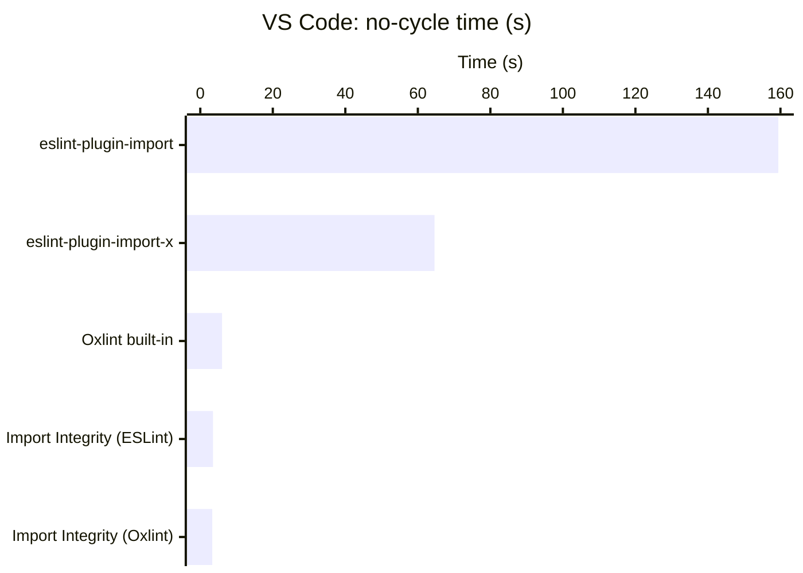
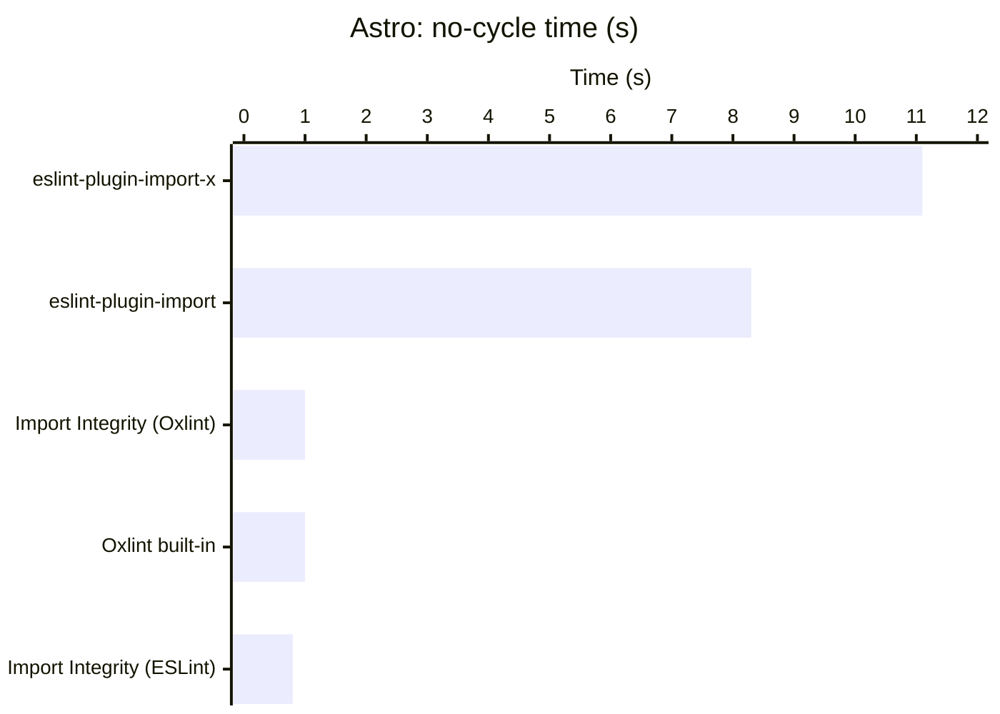
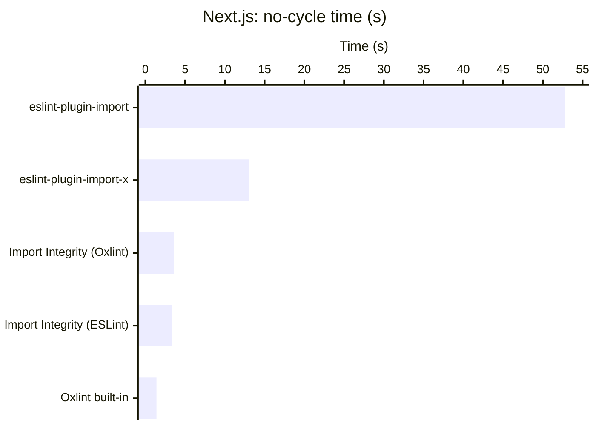

# Comparisons to other plugins

This page compares Import Integrity against other tools that overlap with parts of its functionality:

- **[`eslint-plugin-import`](https://github.com/import-js/eslint-plugin-import)** is the oldest and most widely-used ESLint plugin for import/export linting. It covers a broad set of rules around imports, exports, and module resolution.
- **[`eslint-plugin-import-x`](https://github.com/un-ts/eslint-plugin-import-x)** is a fork of `eslint-plugin-import` that's faster and uses more modern internals. It inherits most of the rule set and the same overall design.
- **[Oxlint](https://oxc.rs/docs/guide/usage/linter)** is a Rust-based linter from the Oxc project. Its built-in rule set is more limited than ESLint's ecosystem but runs much faster.

## Feature comparison

| Capability | Import Integrity | eslint-plugin-import | eslint-plugin-import-x | ESLint built-ins | Oxlint built-ins |
| --- | --- | --- | --- | --- | --- |
| Detects unused exports | ✓ | ✓ | ✓ |  |  |
| Detects circular imports | ✓ | ✓ | ✓ |  | ✓ |
| Enforces test/prod separation | ✓ |  |  |  |  |
| Enforces user-defined import boundaries | ✓ | ✓ | ✓ | _partial_ |  |
| Catches common entry-point and export mistakes | ✓ | _partial_ | _partial_ |  |  |
| Resolver included; no plugin to configure | ✓ |  |  |  | ✓ |
| Monorepo-aware analysis across packages | ✓ |  |  |  |  |

The matrix shows where each tool's capabilities overlap. A few rows warrant more detail.

**User-defined import boundaries.** Both Import Integrity and `eslint-plugin-import`/`eslint-plugin-import-x`'s `no-restricted-paths` are resolution-aware: aliases and relative paths to the same file are treated as equivalent (ESLint's built-in `no-restricted-imports` is not). The two differ in setup: `eslint-plugin-import`/`eslint-plugin-import-x` works without a resolver, but struggles to reliably catch what you expect unless you choose, install, and configure the right resolver plugin for your codebase. Import Integrity ships its own out of the box. [How it works](./how-it-works.md) covers the resolver in more detail.

**Entry-point and subtle export mistakes.** `eslint-plugin-import` and `eslint-plugin-import-x` cover pieces of this category (`no-named-as-default` and a few related rules), but not broader entry-point validation. Import Integrity adds rules for empty entry points, imports between entry points, and other subtle export mistakes that don't show up until something breaks.

**Monorepo and test/prod coverage.** Several rows in the table highlight Import Integrity's unique capabilities. Monorepo-aware analysis means that each package's exports are tracked and analyzed for use in other packages, which allows us to find dead code masked by an export statement. Test/prod separation has dedicated rules for clean separation of test and production code, and for flagging production exports whose only consumers are tests, a.k.a. dead code obscured by a test import.

## Performance and Accuracy

Import Integrity was benchmarked against the other plugins on three real-world codebases of different shapes and sizes.

### Methodology

Oxlint and ESLint were each run with two configurations: a baseline that enables only `no-debugger` (a trivial rule whose detection cost is essentially free), and a test that enables only the rule under comparison. Each configuration was run five times in separate, isolated processes. The reported timing is the median test time minus the median baseline time, approximating the rule's cost without the overhead of the linter itself.

Benchmarks were run on a gaming desktop running Linux Mint 22.2 with:
- AMD Ryzen 5 5600X (6 cores / 12 threads)
- 128GB of DDR4 memory
- Samsung 980 Pro NVMe SSD in an M.2 slot

The machine wasn't thermally constrained during runs (max CPU temperature was 32°C), and run-to-run variance was within 1%. Full benchmark configurations and instructions are available in forked repositories for [VS Code](https://github.com/nebrius/vscode/tree/fast-import-perf), [Astro](https://github.com/nebrius/astro/tree/fast-import-perf), and [Next.js](https://github.com/nebrius/next.js/tree/fast-import-perf), if you would like to reproduce these numbers on your own machine.

### VS Code

A large, deeply-connected single-package codebase.

- 7,199 files
- 121,040 imports
- 21,709 exports

| Tool | Cycles found | Time |
| --- | --- | --- |
| Oxlint built-in | 1,537 | 5,951ms |
| Import Integrity (Oxlint host) | 1,537 | 3,335ms |
| Import Integrity (ESLint host) | 1,537 | 3,479ms |
| `eslint-plugin-import` | 738 | 159,436ms |
| `eslint-plugin-import-x` | 738 | 64,560ms |

Import Integrity and Oxlint's built-in `no-cycle` agree exactly on cycle count. `eslint-plugin-import` and `-x` find about half as many cycles.

### Astro

A monorepo with lighter graph density than VS Code.

- 6,219 files
- 13,507 imports
- 3,778 exports

| Tool | Cycles found | Time |
| --- | --- | --- |
| Oxlint built-in | 66 | 965ms |
| Import Integrity (Oxlint host) | 64 | 1,013ms |
| Import Integrity (ESLint host) | 64 | 782ms |
| `eslint-plugin-import` | 53 | 8,252ms |
| `eslint-plugin-import-x` | 53 | 11,052ms |

The 2-cycle gap between Import Integrity and Oxlint's built-in is in `.astro` files, which Oxlint processes but Import Integrity doesn't process.

### Next.js

A large monorepo with many small files and a sparse graph.

- 23,154 files
- 28,310 imports
- 19,029 exports

| Tool | Cycles found | Time |
| --- | --- | --- |
| Oxlint built-in | 174 | 1,365ms |
| Import Integrity (Oxlint host) | 179 | 3,576ms |
| Import Integrity (ESLint host) | 179 | 3,255ms |
| `eslint-plugin-import` | 114 | 52,813ms |
| `eslint-plugin-import-x` | 114 | 13,032ms |

The 5-cycle gap between Import Integrity (179) and Oxlint's built-in (174) is explained by two factors: Import Integrity counts 6 self-imports (files that import themselves) which Oxlint deliberately excludes from its cycle count, and Oxlint reports one cycle twice.

### Observations

Across all three benchmarks, Import Integrity and Oxlint's built-in `no-cycle` agree on cycle count exactly (VS Code) or with small explainable gaps (Astro, Next.js). `eslint-plugin-import` and `-x` consistently find fewer cycles than the other tools, by 17% on Astro, 36% on Next.js, and 52% on VS Code. We haven't investigated this gap in detail.

One technical note relevant to interpreting performance numbers: Import Integrity, `eslint-plugin-import`, `eslint-plugin-import-x` parse each file twice. One parse is performed by the plugin to build the whole module graph upfront. The other parse is when the ESLint/Oxlint parses the file itself to pass the AST to the plugin (which we have to discard). This is a consequence of plugin APIs being synchronous and per-file, but whole-codebase analysis needs the full graph before it can report on the first file. Oxlint's built-in rule presumably avoids this overhead due to having more direct access to internals via Rust, but this has not been confirmed.

On performance, Import Integrity is roughly 17x faster than `eslint-plugin-import` and 9x faster than `eslint-plugin-import-x` across the three benchmarks (geometric mean). Against Oxlint's built-in `no-cycle`, the picture varies by codebase shape, but are generally similar to each other. Oxlint's underlying linter is multi-threaded and written in Rust, so unsurprisingly it's faster than Import Integrity for many workloads. What is surprising is that Import Integrity is faster on VS Code despite parsing each file twice, and is still competitive across the board.

To summarize: Import Integrity offers high performance, and it's performance advantage becomes more pronounced as codebase complexity increases.
